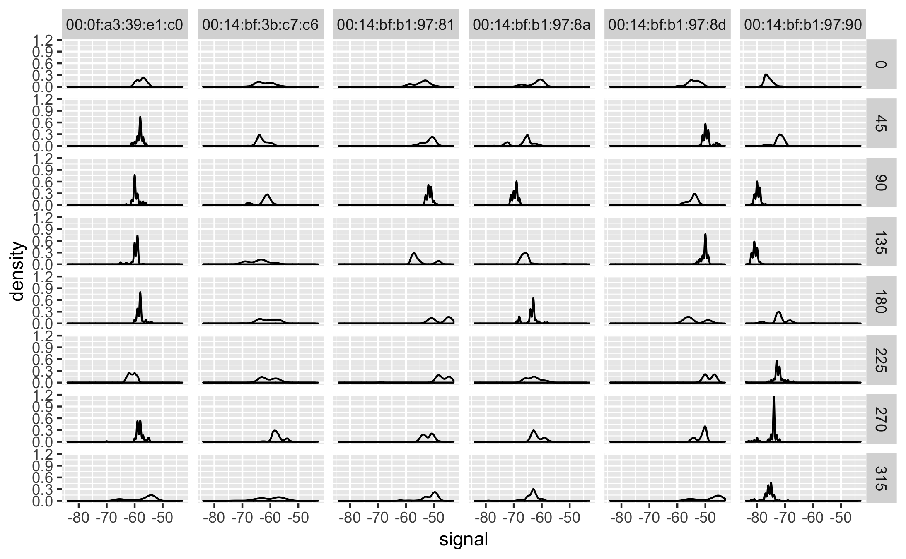

[TOC levels=1-3]: #

# Table of Contents
- [Table of Contents](#table-of-contents)
- [Name](#name)
- [Assignment one: web crawler in R](#assignment-one-web-crawler-in-r)
- [Assignment two: basic data manipulation](#assignment-two-basic-data-manipulation)
- [Assignment three: basic statiscal plotting](#assignment-three-basic-statiscal-plotting)
- [Author](#author)

# Name
Nju-datascience - recombination of the assignments in the course `Data Science and Innovation`, instruted by Terman Huang.

# Assignment one: web crawler in R

# Assignment two: basic data manipulation
The requirement of assignment could be found in the sub-directory [`assign-requirements/`](#assign-requirements/). This assignment is all about the simple manipulation skills to import and prepare the given data.

```r
library(tidyverse)

data_process <- function(filepath){
    # import data and delete the first column and the first row
    raw_data <- read_csv(filepath) %>% .[-1, -1] %>% 
    # set the new colnames
    setNames(c("id", "name", "salary", "start_date", "dept")) %>%
    # change the data structure of the salary and the start_date
    mutate(salary = as.numeric(salary), start_date = as.Date(start_date)) %>% 
    # create a new column to store some information
    mutate(comment = paste(name, "entered", dept, "on", start_data)) %>% 
    # create a new column named flag to store the information that whether the row has N/A value; bool str
    mutate(flag = is.na(id) + is.na(name) + is.na(salary) + is.na(start_data) + is.na(dept)) %>% 
    mutate(flag = as.logical(flag))
}
# call the function twice
df1 <- data_process("./input1.csv")
df2 <- data_process("./input2.csv")
# combine the two dataframe by rows
dfall <- rbind(df1, df2) %>% unique(.)
```

# Assignment three: basic statiscal plotting
The requirement of assignment could be found in the sub-directory [`assign-requirements/`](#assign-requirements/). The assignment is based on one practical case to use the data manipulation skills, and after we got the required data, the plotting procedure would become easier.

**Data preparation**
```r
library(tidyverse)
# create the function to deal with each line in the original data file
processLine = function(x){	
    # split the line based on three division symbol ; = , 
    tokens <- strsplit(x,"[;=,]")[[1]]
    # delete the record without any signal
	if(length(tokens)==10) return(NULL)
	tmp <- matrix(tokens[-(1:10)], ncol=4, byrow = TRUE)
	mat <- cbind(matrix(tokens[c(2,4,6:8,10)], nrow = nrow(tmp), ncol=6, byrow = TRUE), tmp)
	return(mat)
}
# create the function to group the orientation by 8 different angles
roundOrientation = function(angels)
{
  refs <- seq(0,by=45,length=9)
  q <- sapply(angels,function(o) which.min(abs(o-refs)))
  c(refs[1:8],0)[q]
}

# read the raw data files line by line
txt <- readLines("./offline.final.trace.txt")
# delete the annotation lines
lines <- txt[substr(txt,1,1)!="#"]
# deal each line in the raw data file using function processLine
tmp <- lapply(lines, processLine)
# create the dataframe to store all the data
offline <- as.data.frame(do.call("rbind",tmp), stringsAsFactors=FALSE)
# rename the cols
names(offline) <- c("time","scanMac","posX","posY","posZ","orientation","mac","signal","channel","type")
# choose the names of the columns needed to be changed to numeric
numVars <- c("time","posX","posY","posZ","orientation","signal")
# change str to numeric
offline[numVars] <- lapply(offline[numVars], as.numeric)
# practical useful manipulation to filter the type 
offline <- offline[offline$type == "3",]
offline <- offline[,"type"!=names(offline)]
# change the time data into sepcific data structure
offline$rawTime <- offline$time
offline$time <- offline$time/1000
class(offline$time) <- c("POSIXt","POSIXct")
# delete two columns
offline <- offline[ , !(names(offline) %in% c("scanMac","posZ"))]

# group_by work about the orientation using function roundOrientation
offline$angle = roundOrientation(offline$orientation)
# choose the most 7 devices for further analysis
subMacs = names(sort(table(offline$mac),decreasing=TRUE))[1:7]
offline = offline[offline$mac %in% subMacs,]
```

**boxplot**
```r
task1 <- offline %>% 
  # choose the specific position
  filter(posX == 2, posY == 12) %>% 
  # filter out the noisy device
  filter(mac != "00:0f:a3:39:dd:cd") %>% 
  ggplot() +
  # basic boxplot
  geom_boxplot(aes(x = factor(angle), y = signal)) + 
  # create the sub figures by the devices
  facet_wrap(~mac)

task1
ggsave("./basic_boxplot.png", dpi = "print")
```


**density plot**
```r
task2 <- offline %>% 
  # choose the specific position
  filter(posX == 24, posY == 4) %>% 
  # filter out the noisy device
  filter(mac != "00:0f:a3:39:dd:cd") %>% 
  ggplot() +
  # basic density plot about the signal value
  geom_density(aes(signal)) +
  # create subfigures based on angle and devive categories
  facet_grid(rows = vars(angle), cols = vars(mac))

task2
ggsave("./basic_densityplot.png", dpi = "print")
```



**violin plot and heat plot**
```r
task3 <- offline %>% 
  # choose the specific position
  filter(posX == 2, posY == 12) %>% 
  # filter out the noisy device
  filter(mac != "00:0f:a3:39:dd:cd") %>% 
  ggplot() +
  # basic violin plot
  geom_violin(aes(x = factor(angle), y = signal, fill = factor(angle))) + 
  # create subfigures 
  facet_wrap(~mac)

task3df <- offline %>% 
  filter(posX == 2, posY == 12) %>% 
  filter(mac != "00:0f:a3:39:dd:cd") %>% 
  select(mac, angle, signal)

q <- task3df %>% 
  ggplot(aes(x= angle, y= mac))+
  geom_tile(aes(fill = signal)) 
```


**function implementation**

The procedure to draw basic boxplot and density plot could also been implenmented into function, which could take the position argument as function argument to plot the conditions at specific given location. 
```r
# boxplot
boxplot_pos <- function(posX, posY){
    offline %>%
    # choose the specific position
    filter(posX == posX, posY == posY) %>% 
    # filter out the noisy device
    filter(mac != "00:0f:a3:39:dd:cd") %>% 
    ggplot() +
    # basic boxplot
    geom_boxplot(aes(x = factor(angle), y = signal)) + 
    # create the sub figures by the devices
    facet_wrap(~mac)
}

# density plot
density_pos <- function(posX, posY){
    offline %>% 
    # choose the specific position
    filter(posX == 24, posY == 4) %>% 
    # filter out the noisy device
    filter(mac != "00:0f:a3:39:dd:cd") %>% 
    ggplot() +
    # basic density plot about the signal value
    geom_density(aes(signal)) +
    # create subfigures based on angle and devive categories
    facet_grid(rows = vars(angle), cols = vars(mac))
}
```

# Author
Jihong Tang &lt;njutangjihong@gmail.com&gt;